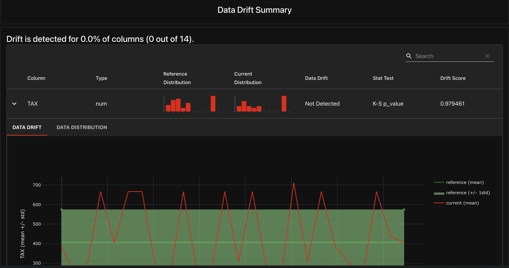

# Boston Housing Price Prediction API

Pipeline **MLOps end-to-end** para entrenar y desplegar un modelo de **regresión** sobre el dataset de **Boston Housing**. Incluye versionado de datos con **DVC**, entrenamiento reproducible con **AutoML (FLAML)**, artefactos versionados y una **API** en **FastAPI** lista para producción con base de datos PostgreSQL.

---

## 📋 Tabla de Contenidos

- [⚙️ Prerrequisitos](#️-prerrequisitos)
- [🚀 Inicio Rápido](#-inicio-rápido)
- [🏗️ Arquitectura del Proyecto](#️-arquitectura-del-proyecto)
- [📊 Visualización del Pipeline](#-visualización-del-pipeline)
- [🧠 Entrenamiento del Modelo](#-entrenamiento-del-modelo)
- [🔌 Uso de la API](#-uso-de-la-api)
- [📊 Monitoreo y Evaluación](#-monitoreo-y-evaluación)
- [🔄 CI/CD y Automatización](#-cicd-y-automatización)
- [🧪 Testing](#-testing)
- [📈 Características del Modelo](#-características-del-modelo)
- [📈 Presentación PDF-Explicativa](#-Presentación PDF-Explicativa)
- [uso de herramientas AI](#-uso de herramientas AI)

---

## ⚙️ Prerrequisitos

### Software Requerido
- **Python 3.11+**
- **Git**
- **Docker & Docker Compose**
- **`uv`** → `pip install uv`

### Verificar Instalación
```bash
# Instalar uv si no lo tienes
pip install uv

# Verificar versiones
python --version  # Debe ser 3.11+
docker --version
docker-compose --version
```

---

## 🚀 Inicio Rápido

### 1. Clonar y Preparar
```bash
# Clonar el repositorio
git clone https://github.com/jdrincone/boston-housing.git
cd boston-housing

# Crear entorno virtual e instalar dependencias
uv venv
source .venv/bin/activate  # Linux/macOS
# .venv\Scripts\activate   # Windows
uv pip install -r requirements.txt
```

### 2. Entrenar el Modelo
```bash
# Descargar datos y entrenar modelo
dvc pull
dvc repro
```

### 3. Desplegar con Docker
```bash
# Levantar todos los servicios
docker-compose up --build
```

### 4. Probar la API
```bash
# Health check
curl http://localhost:8000/

# Realizar predicción
curl -X POST "http://localhost:8000/predict" \
     -H "Content-Type: application/json" \
     -d '{
       "CRIM": 0.02731,
       "ZN": 0.0,
       "INDUS": 7.07,
       "CHAS": 0,
       "NOX": 0.469,
       "RM": 6.421,
       "AGE": 78.9,
       "DIS": 4.9671,
       "RAD": 2,
       "TAX": 242,
       "PTRATIO": 17.8,
       "B": 396.9,
       "LSTAT": 9.14
     }'
```

**Servicios disponibles:**
- 🌐 **API**: http://localhost:8000
- 📚 **Documentación**: http://localhost:8000/docs
- 🗄️ **Base de datos**: localhost:5432

---

## 🏗️ Arquitectura del Proyecto

```
boston-housing/
├── app/                          # 🌐 API FastAPI
│   ├── main.py                   # Endpoints principales
│   ├── schemas.py                # Validación Pydantic
│   └── database.py               # Configuración PostgreSQL
├── src/                          # 🤖 Pipeline de ML
│   ├── config.py                 # Configuración y rutas
│   ├── data_manager.py           # I/O de modelos y métricas
│   ├── pipeline.py               # Pipeline ML con FLAML
│   └── train.py                  # Script de entrenamiento
├── scripts/                      # 📜 Scripts de utilidad
│   ├── prepare_data.py           # División train/backtest
│   └── backtesting.py            # Evaluación del modelo
├── data/                         # 📊 Datos (DVC tracked)
│   ├── HousingData.csv           # Dataset original
│   ├── train_data.csv            # Datos de entrenamiento
│   └── backtest_data.csv         # Datos de backtesting
├── docs/                         # 📊 Documentos Explicativos y Diagramación
│   ├── boston_housing_presentation.pdf           
    ....

├── models/                       # 🎯 Modelos (DVC tracked)
│   └── best_pipeline.pkl         # Pipeline completo serializado
├── reports/                      # 📈 Reportes (DVC tracked)
│   ├── metrics.json              # Métricas del modelo
│   ├── shap_summary.png          # Análisis SHAP
│   ├── feature_importance.png    # Importancia de features
│   ├── automl_summary.txt        # Resumen de AutoML
│   ├── main.log                  # Logs de entrenamiento
│   ├── drift.html                # Reporte de Drift
│   └── backtest_report.csv       # Resultado de Backtesting
├── tests/                        # 🧪 Tests unitarios
│   ├── test_api.py               # Tests de la API
│   └── test_training.py          # Tests del pipeline
├── .github/workflows/            # 🔄 CI/CD
│   ├── ci.yml                    # Pipeline de CI
│   └── retrain_model.yml         # Reentreno automático
├── docs/                         # 📚 Documentación
│   └── HousingData-*.svg         # Diagramas del pipeline
├── dvc.yaml                      # Configuración DVC
├── params.yaml                   # Parámetros del modelo
├── docker-compose.yml            # Orquestación de servicios
├── Dockerfile                    # Imagen de la API
└── requirements.txt              # Dependencias Python
```

---

## 📊 Visualización del Pipeline



### Monitoreo de Drift

[Ver Informe Completo](reports/drift.html)

---

## 🧠 Entrenamiento del Modelo

### Comandos Básicos
```bash
# Descargar datos
dvc pull

# Ejecutar pipeline completo
dvc repro

# Ver el grafo del pipeline
dvc dag

# Reentreno forzado
dvc repro --force
```

### Artefactos Generados
- ✅ **Modelo**: `models/best_pipeline.pkl`
- ✅ **Métricas**: `reports/metrics.json`
- ✅ **Reportes**: SHAP plots, feature importance
- ✅ **Logs**: `reports/main.log`

---

## 🔌 Uso de la API

### Health Check
```bash
curl http://localhost:8000/
```

**Respuesta:**
```json
{
  "status": "ok",
  "message": "API is running!"
}
```

### Realizar Predicción
```bash
curl -X POST "http://localhost:8000/predict" \
     -H "Content-Type: application/json" \
     -d '{
       "CRIM": 0.02731,
       "ZN": 0.0,
       "INDUS": 7.07,
       "CHAS": 0,
       "NOX": 0.469,
       "RM": 6.421,
       "AGE": 78.9,
       "DIS": 4.9671,
       "RAD": 2,
       "TAX": 242,
       "PTRATIO": 17.8,
       "B": 396.9,
       "LSTAT": 9.14
     }'
```

**Respuesta:**
```json
{
  "prediction": 24.5
}
```

### Documentación Interactiva
Visita http://localhost:8000/docs para la documentación interactiva de la API.

---

## 📊 Monitoreo y Evaluación

### Backtesting del Modelo
```bash
# Asegúrate de que la API esté corriendo
docker-compose up --build

# En otra terminal, ejecuta el backtesting
python -m scripts.backtesting
```

**Archivos generados:**
- `reports/backtest_report.csv` - Predicciones vs valores reales
- `reports/backtest.log` - Logs del proceso

### Métricas Disponibles
- **Logs de entrenamiento**: `reports/main.log`
- **Métricas del modelo**: `reports/metrics.json`
- **Análisis SHAP**: `reports/shap_summary.png`
- **Importancia de features**: `reports/feature_importance.png`
- **Resumen AutoML**: `reports/automl_summary.txt`

---

## 🔄 CI/CD y Automatización

### Pipeline de CI/CD
El proyecto incluye automatización completa con GitHub Actions:

#### **CI Pipeline** (`.github/workflows/ci.yml`)
- ✅ **Triggers**: Push a `main`/`develop`, PRs a `main`
- ✅ **Validaciones**: Linting (Ruff), Tests (pytest), DVC
- ✅ **Servicios**: PostgreSQL 13 con health checks

#### **Reentreno Automático** (`.github/workflows/retrain_model.yml`)
- ✅ **Triggers**: Manual + cada 3 días a las 02:00 UTC
- ✅ **Proceso**: Reentreno completo + push de artefactos
- ✅ **Monitoreo**: Logs detallados en GitHub Actions

### Configuración de Secrets 
## (SOLO SI SE DESEA TRACKAR LOS ARTEFACTOS EN UN REPO REMOTO/ DE LO CONTRARIO ESTOS QUEDAN EN LOCAL EN .dvc/cache)
## Completamente agnostico a una nube
Configura en GitHub Settings → Secrets and variables → Actions:
- `AWS_ACCESS_KEY_ID`
- `AWS_SECRET_ACCESS_KEY`

---

## 🧪 Testing

```bash
# Ejecutar todos los tests
pytest

# Tests específicos
pytest tests/test_api.py
pytest tests/test_training.py

```

---

## 📈 Características del Modelo

### Features Utilizadas (13 variables)
| Feature | Descripción |
|---------|-------------|
| **CRIM** | Tasa de criminalidad per cápita |
| **ZN** | Proporción de terreno residencial zonificado |
| **INDUS** | Proporción de acres de negocio no minorista |
| **CHAS** | Variable dummy del río Charles |
| **NOX** | Concentración de óxidos nítricos |
| **RM** | Número promedio de habitaciones por vivienda |
| **AGE** | Proporción de unidades ocupadas construidas antes de 1940 |
| **DIS** | Distancias ponderadas a cinco centros de empleo de Boston |
| **RAD** | Índice de accesibilidad a autopistas radiales |
| **TAX** | Tasa de impuesto a la propiedad |
| **PTRATIO** | Ratio alumno-profesor por ciudad |
| **B** | Proporción de afroamericanos por ciudad |
| **LSTAT** | % de estatus socioeconómico bajo |

### Pipeline de ML
1. **Imputación**: Valores faltantes con mediana
2. **Escalado**: StandardScaler
3. **AutoML**: FLAML con búsqueda automática de hiperparámetros
4. **Métricas**: R², MSE, RMSE, MAE
5. **Explicabilidad**: SHAP y feature importance

### Tecnologías
- **API**: FastAPI + Uvicorn
- **Base de datos**: PostgreSQL + SQLAlchemy
- **Contenerización**: Docker + Docker Compose
- **Versionado**: Git + DVC
- **Gestión de entorno**: `uv`
- **Modelado**: scikit-learn, FLAML (AutoML), SHAP, XGBoost
- **Testing**: pytest + httpx
- **Linting**: ruff

---


# Verifica que el modelo existe
ls -la models/best_pipeline.pkl
```

```bash
# 1. Verifica que el modelo esté entrenado
ls -la models/best_pipeline.pkl

# 2. Si no existe, entrena el modelo
dvc repro

# 3. Reinicia la API
docker-compose restart api
```
```

```bash
# Configura el remoto DVC
dvc remote add -d myremote s3://tu-bucket
dvc remote modify myremote access_key_id TU_ACCESS_KEY
dvc remote modify myremote secret_access_key TU_SECRET_KEY
```

## Herramientas de IA usadas (breve)

* **Mermaid (mermaidchart)**: para **diagramar** la arquitectura, el pipeline (DVC) y los flujos de predicción/serving de forma rápida y editable en texto.
* **Cursor**: asistente de código y redacción técnica para **borradores de README y documentación**. Útil para iterar rápido, aunque **siempre validando y corrigiendo** lo que sugiere (evita “inventos”).
* **Gemini**: apoyo para **estructurar el flujo en DVC** (stages, dependencias y artefactos), proponiendo esquemas que luego se ajustaron al contexto real del repo.

**Conclusión:** estas herramientas no sustituyen la verificación técnica, pero son una **gran ayuda para aterrizar ideas y prototipos con velocidad**, reduciendo tiempo en primeras versiones de diagramas, documentación y estructura del pipeline.
